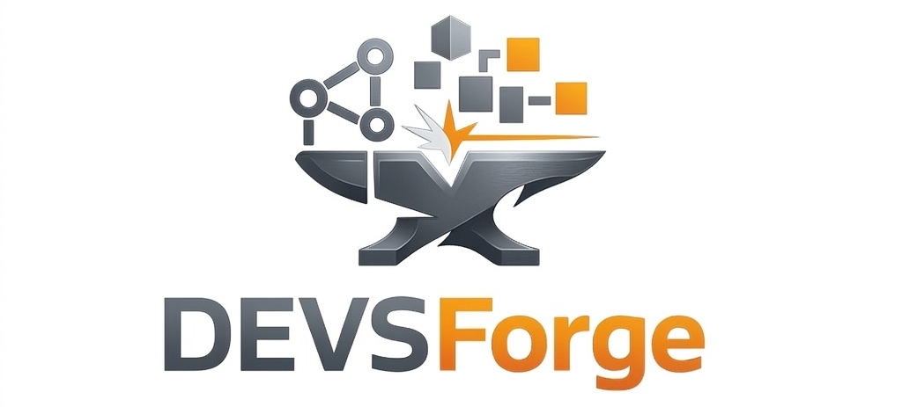

# DEVSForge



[](https://github.com/Doto-Apps/DEVSForge/actions/workflows/docker-ci.yml)
[](https://github.com/Doto-Apps/DEVSForge/actions/workflows/docker-publish.yml)
[](https://doi.org/10.5281/zenodo.19219365)
[](LICENSE)

DEVSForge is an AI-assisted modeling and simulation platform for DEVS systems.

## Architecture of DEVSForge
1. Frontend (React) calls backend REST APIs (typed from OpenAPI).
2. Backend (Go/Fiber) stores data in PostgreSQL.
3. Simulation orchestration uses Kafka and simulator components (coordinator + runners).
4. Wrappers (Go/Python) execute atomic-model behavior.

## Try it online

- Go to [DEVSForge website](https://devsforge.doto.ovh)

## Choose Your Install Mode

### Mode A: Run From GHCR Images (Recommended for self-hosting)
Use this mode to run DevForge quickly without local build.

1. Clone repository (to get compose and env templates):
```bash
git clone https://github.com/Doto-Apps/DEVSForge
cd DEVSForge
```

2. Prepare release env:
```bash
cp .env.dist .env
```

4. Pull and run:
```bash
docker compose pull
docker compose up -d
```

5. Access:
- Frontend: `http://localhost`
- Backend: `http://localhost:3000`
- Swagger: `http://localhost:3000/swagger/index.html`

Stop:
```bash
docker compose down
```

### Mode B: Local Development Stack (Recommended for development)
Use this mode when actively developing frontend/backend.

1. Create local env files:
```bash
cp .env.back.dist .env.back
cp .env.front.dist .env.front
```
PowerShell:
```powershell
Copy-Item .env.back.dist .env.back
Copy-Item .env.front.dist .env.front
```

2. Start backend (terminal 1, hot reload):
```bash
pnpm run start:back
```

3. Start frontend (terminal 2, hot reload):
```bash
pnpm run start:front
```

4. Access:
- Frontend: `http://localhost:5173`
- Backend: `http://localhost:3000`
- Swagger: `http://localhost:3000/swagger/index.html`

## Docker Images
- Frontend: `ghcr.io/doto-apps/devsforge-frontend`
- Backend: `ghcr.io/doto-apps/devsforge-backend`

Published by tag workflow (`v*`) in GitHub Actions.

## Repository Navigation
| Module | Purpose | Documentation |
| --- | --- | --- |
| `back/` | API, persistence, AI generation, simulation orchestration | [back/README.md](back/README.md) |
| `front/` | UI for modeling, generation, validation, simulation, webapps | [front/README.md](front/README.md) |
| `simulator/` | DEVS distributed runtime (coordinator, runners, shared contracts) | [simulator/README.md](simulator/README.md) |
| `simulator/wrappers/` | Go/Python wrapper runtimes and gRPC bridge | [simulator/wrappers/README.md](simulator/wrappers/README.md) |
| Reproducibility assets | Case-study protocols and experiment flow | [docs/reproducibility.md](docs/reproducibility.md), [docs/light_case.md](docs/light_case.md) |

## Reproducibility
- Main guide: [docs/reproducibility.md](docs/reproducibility.md)
- Lightweight scenario: [docs/light_case.md](docs/light_case.md)
- Stable archival DOI (concept, always latest release): `10.5281/zenodo.19219365`
- Version DOI used for the current archived artifact (`v0.0.2`): `10.5281/zenodo.19219366`

## Citation
Citation metadata is available in [`CITATION.cff`](CITATION.cff).

BibTeX:
```bibtex
@software{dominici_devsforge,
  author       = {Dominici, Antoine and Maliszewski, Dorian and Capocchi, Laurent},
  title        = {DEVSForge},
  year         = {2026},
  url          = {https://github.com/Doto-Apps/DEVSForge}
}
```

## License
MIT - see [LICENSE](LICENSE).
